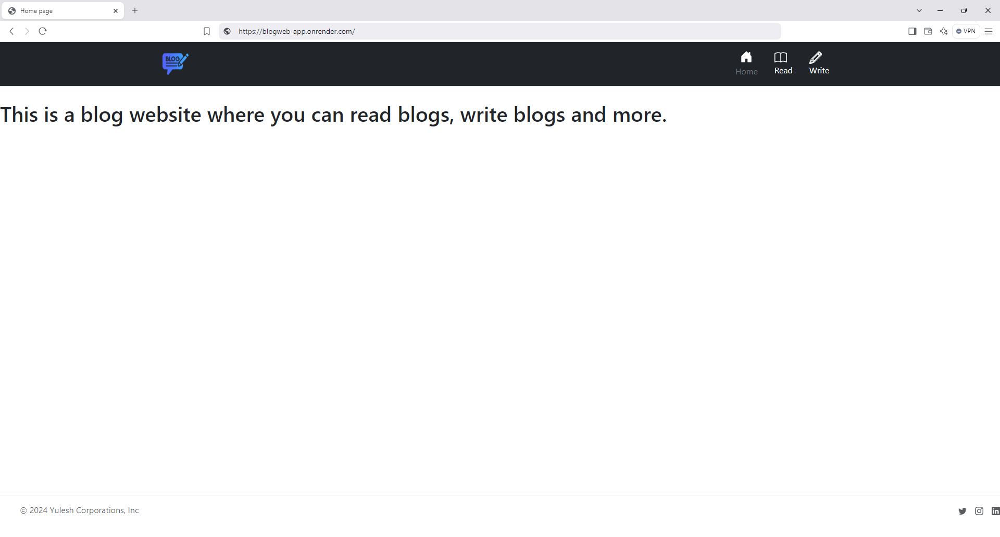
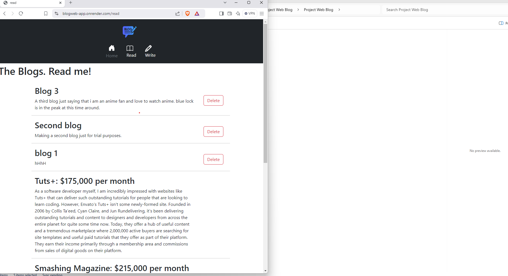

# BlogWeb-App
**Description**

A responsive blog web application that allows users to create and delete blog posts. It provides a user-friendly interface and is designed for seamless performance across devices.

**Features**

1. Create new blog posts using a structured form.

2. View all blog posts in a neat, scrollable list.  

3. Delete unwanted blog posts with a single click.
   
4. Fully responsive design for desktops, tablets, and mobile devices.

**Technologies Used**

Frontend: HTML, CSS, JavaScript, Bootstrap  

Backend: Node.js, Express.js

Database: In-memory storage of blogs

Hosting: Render 

**Demo**

https://blogweb-app.onrender.com/

https://github.com/yuleshmahatkazuto/BlogWeb-App

**Test Screenshots**

**Challenges Faced**
1. Difficulty creating the logic to delete the blogs.
2. Difficulty using xlmns from bootstrap.

**Future advancement**
1. Added database system to retain the blogs and information.
2. Edit and update blog feature.
3. User login and credentials verification feature.

**Author**
Yulesh Mahat
yuleshkazuto@gmail.com   
https://www.linkedin.com/in/yulesh-mahat-a94621308/

